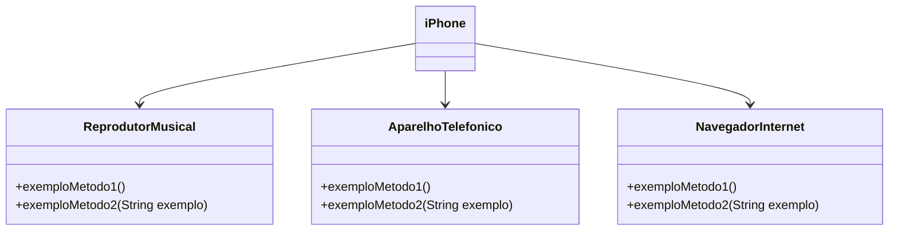

# Desafios-do-BootCamp-Santander

[Repositório do Sistema](https://github.com/Manoel-DJS/Desafios-do-BootCamp-Santander)

## 📘📚💻

## DIO - Trilha Java Básico

- Primeiro Desafio(1): Desafio de Sintaxe
- Por em prática os fundamentos da linguagem e noções de regras de estrutura de sintaxe.

## Controle de Fluxo - Desafio

- Segundo Desafio(2): Controle de fluxo
- Exercitar todo o conteúdo apresentado no módulo

## Modelagem e Diagramação de um Componente iPhone - Trabalhando

